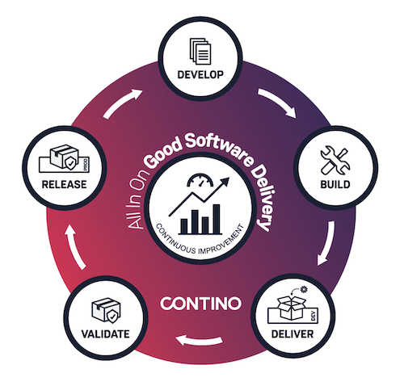

Congratulations!

You've mastered the basic concepts of GSD and 3 Musketeers (Make, Compose and Docker).

Want to try this on your local computer? Head over to [https://github.com/contino/gsd-hello-world](https://github.com/contino/gsd-hello-world) and clone the repo for yourself.

May your software be good, and your delivery be continuous.
