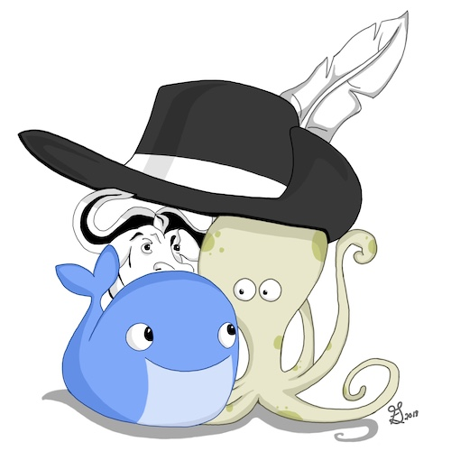

Welcome to the start of your GSD journey. Please be patient as your enviorment loads.

# Review the key files

There are three key files that drive this repo, and when used together like we've done, they're called the [3 Musketeers](https://3musketeers.io/) pattern.

- `Makefile`{{open}}
- `docker-compose.yml`{{open}}
- `Dockerfile`{{open}}

We'll step through each of these files in more detail in the next few steps.

You can also read more about why and how you might use this [3 Musketeers Pattern for a better developer experince](https://medium.com/@drew.khoury/3-musketeers-for-an-epic-developer-experience-8676ddaf33b2) in your repo.

# Explore the key features of this demo

When 3 Musketeers has been implemented, day-to-day operations can be as simple as the following...

You can build the app with: `make build`{{execute}}

- Note: We've cached the docker layers in this demo so it should be quick for you

You can run the tests for the app: `make test`{{execute}}

You can deploy the app: `make run`{{execute}}

Once the app is running, you can browse it via: `curl localhost:8080`{{execute}}

Don't forget to clean up after yourself with `make down`{{execute}}
